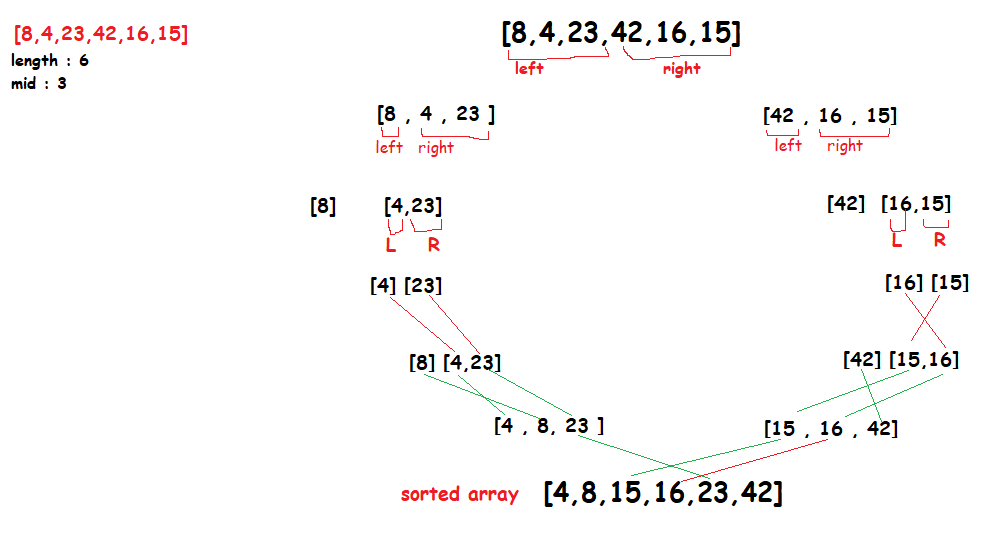

# Merge Sort

Merge sort is one of the most efficient sorting algorithms. It works on the principle of Divide and Conquer. Merge sort repeatedly breaks down a list into several sublists until each sublist consists of a single element and merging those sublists in a manner that results into a sorted list.

# Pseudocode

ALGORITHM Mergesort(arr)
    DECLARE n <-- arr.length
           
    if n > 1
      DECLARE mid <-- n/2
      DECLARE left <-- arr[0...mid]
      DECLARE right <-- arr[mid...n]
      // sort the left side
      Mergesort(left)
      // sort the right side
      Mergesort(right)
      // merge the sorted left and right sides together
      Merge(left, right, arr)

ALGORITHM Merge(left, right, arr)
    DECLARE i <-- 0
    DECLARE j <-- 0
    DECLARE k <-- 0

    while i < left.length && j < right.length
        if left[i] <= right[j]
            arr[k] <-- left[i]
            i <-- i + 1
        else
            arr[k] <-- right[j]
            j <-- j + 1
            
        k <-- k + 1

    if i = left.length
       set remaining entries in arr to remaining values in right
    else
       set remaining entries in arr to remaining values in left

# Trace 

Sample array: [8,4,23,42,16,15]

pass 1: On the first step, arr.length = 6, mid = 3, left = [8,4,23] ,right = [42,16,15]. And the recursive function will run for the left array, which arr.length = 3, mid = 1, left = [8] ,right = [4,23], then the recursive function for the left will evaluate to false, and will run for the right array, which has arr.length = 2,mid = 1, left = [4],right = [23], and here we done the dividing for the first half it'll run the first merge for (left,right,arr) as ([4],[23],[4,23]), which will return [4,23], then the second merge for (left,right,arr ) as ([8],[4,23],[8,4,23] ), return [4,8,23], and the first left is done.

pass 2: the mergeSort function will run for the right array [42,16,15], which has arr.length = 3,mid= 1, left = [42], right = [16,15], then the recursive function for the left array will evaluate to false, and will run for the right array, which has arr.length = 2,mid = 1, left = [16],right = [15], and the dividing for the second half is done, now run the first merge for (left,right,arr) as ([16],[15],[16,15]), return [15,16], then the second merge for (left,right,arr) as ([42],[15,16],[42,16,15]) return [15,16,42], and the first right is done.

pass 3: now the final merge, which has the values [4,8,23],[15,16,42],[8,4,23,42,16,15] will return [4,8,15,16,23,42] .

# efficiency

Big O: time: O(n*Log n) space: O(n)
