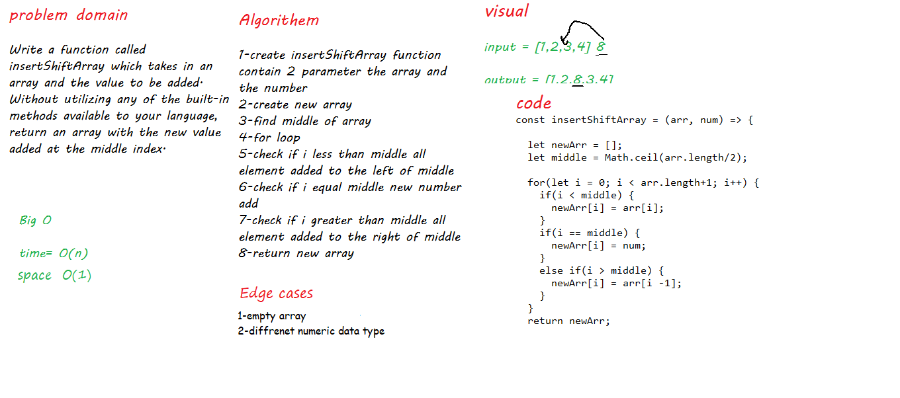

## challange 

Write a function called insertShiftArray which takes in an array and a value to be added. Without utilizing any of the built-in methods available to your language, return an array with the new value added at the middle index.

## Whiteboard Process

## Approach & Efficiency

for loop checks the iteration i against the "middle" variable and when it matches it inserts the value there and returns the new array.
