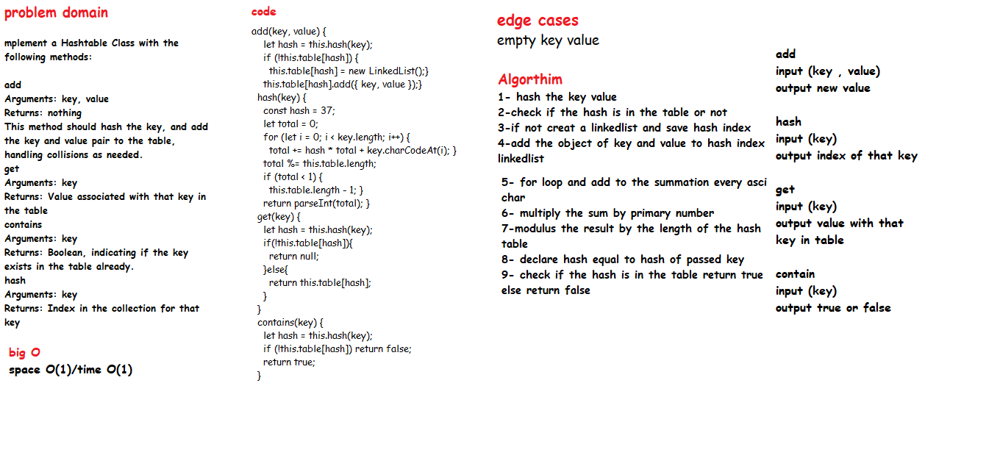

# Hashtables

## Challenge

### Features
Implement a Hashtable Class with the following methods:

- add
Arguments: key, value
Returns: nothing
This method should hash the key, and add the key and value pair to the table, handling collisions as needed.
- get
Arguments: key
Returns: Value associated with that key in the table
- contains
Arguments: key
Returns: Boolean, indicating if the key exists in the table already.
- hash
Arguments: key
Returns: Index in the collection for that key

### Approach & Efficiency

- add: space O(1)/time O(1)
- hash: space O(1)/time O(1)
- contains: space O(1)/time O(1)
- get: space O(1)/time O(1) - time O(n) if there is a collision

### API

- add(key, value):This method should hash the key, and add the key and value pair to the table, handling collisions as needed.

- get(key): takes in the key and returns the value from the table.

- contains(key): takes in the key and returns a boolean, indicating if the key exists in the table already.

- hash(key):takes in an arbitrary key and returns an index in the collection.

