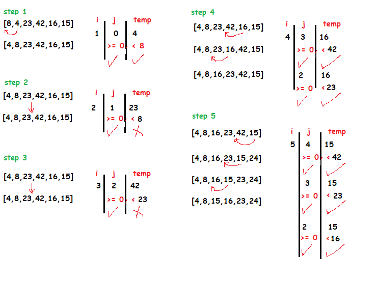

# Insertion sort

Insertion sort is a simple sorting algorithm that works similar to the way you sort playing cards in your hands. The array is virtually split into a sorted and an unsorted part. Values from the unsorted part are picked and placed at the correct position in the sorted part.

# Pseudocode

  InsertionSort(int[] arr)
  
    FOR i = 1 to arr.length
    
      int j <-- i - 1
      int temp <-- arr[i]
      
      WHILE j >= 0 AND temp < arr[j]
        arr[j + 1] <-- arr[j]
        j <-- j - 1
        
      arr[j + 1] <-- temp

# Trace      

Sample array: [8,4,23,42,16,15]

Pass 1: we have nested loops, i to loop through the hole array, j the value we gonna use to check . On the first iteration, i = 1, j = 0 and temp = array[i] = 4 , we check between the first element and the second element 8 and 4 if the second element is less than the first element it's true, the second element will be in place of the first element. The array is [4, 8, 23, 42, 16, 15]

Pass 2:
On the second iteration i = 2, j = 1 and temp = array[i] = 23
we check between the second element and the third element 8  and 23 evaluates to false, so nothing changes. The array is [4, 8, 23, 42, 16, 15].

Pass 3: On the third iteration i = 3, j = 2 and temp = array[i] = 42 .we check between the third element and the fourth element 23 and 42  It evaluates to false, so nothing changes. The array is [4, 8, 23, 42, 16, 15].

Pass 4: On the fourth iteration i = 4, j = 3 and temp = array[i] = 16. we check between the fourth element and the fifth element 420 and 16 evaluates to true. the array  [4, 8, 16, 23, 42, 15].

Pass 5: check for each element if it's smaller move it before. 

# Efficency
Time: O(n^2) Since we are using nested loop the time complexity will increase . 
Space: O(1) We are using the same array and it is being sorted in place O(1).
