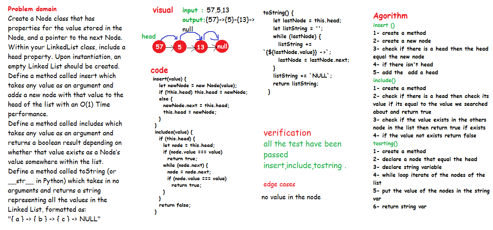
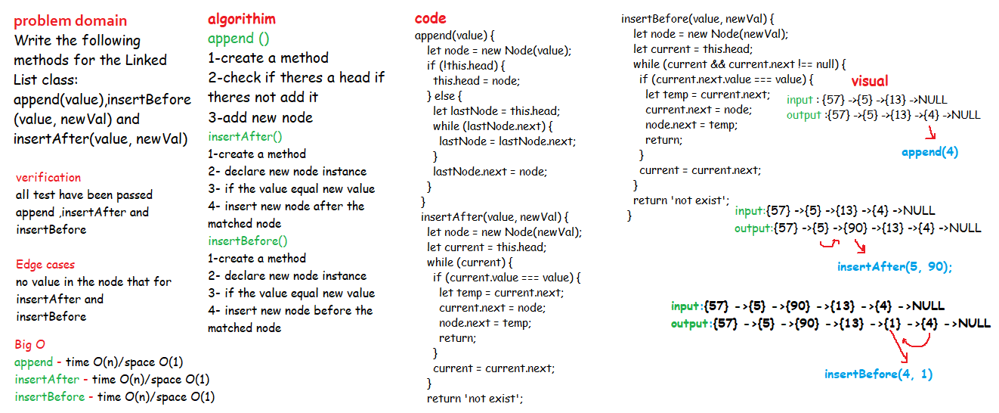

# Singly Linked Lists

# Challenge

- Create a **Node class** that has properties for the value stored in the Node, and a pointer to the next Node.
Within your LinkedList class, include a head property. Upon instantiation, an empty Linked List should be created.
- Define a method called **insert** which takes any value as an argument and adds a new node with that value to the head of the list with an O(1) Time performance.
- Define a method called **includes** which takes any value as an argument and returns a boolean result depending on whether that value exists as a Node’s value somewhere within the list.
- Define a method called **toString** (or __str__ in Python) which takes in no arguments and returns a string representing all the values in the Linked List, formatted as:
"{ a } -> { b } -> { c } -> NULL"
- append(value) which adds a new node with the given value to the end of the list
- insertBefore(value, newVal) which add a new node with the given newValue immediately before the first value node
- insertAfter(value, newVal) which add a new node with the given newValue immediately after the first value node

# Approach & Efficiency

- Insert : space O(1)/time O(1)
- Includes : space O(n)/time O(n)
- toString "space O(1) /time O(n)
- append: time O(n)/space O(1)
- insertAfter: time O(n)/space O(1)
- insertBefore: time O(n)/space O(1)

# API

The linked list code contains two classes, Node class, and LinkedList class thats contain :

1- insert method: which takes any value as an argument and adds a new node with that value to the head of the list
2- includes method: which takes any value as an argument and returns a boolean result depending on whether that value exists as a Node’s value somewhere within the list.
3- toString method:  which takes in no arguments and returns a string representing all the values in the Linked List 
4- append(value) which adds a new node with the given value to the end of the list
5- insertBefore(value, newVal) which add a new node with the given newValue immediately before the first value node
6- insertAfter(value, newVal) which add a new node with the given newValue immediately after the first value node

