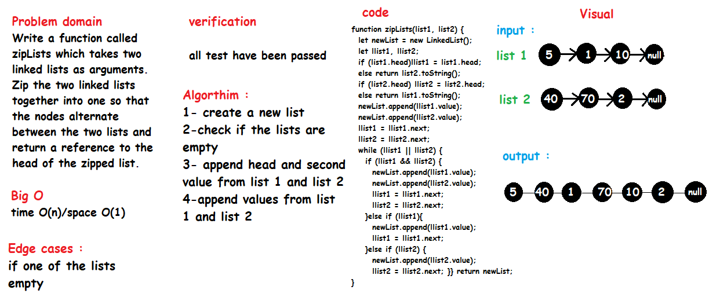

# Code Challenge: Class 08 - Zip two linked lists.

# Challenge

Write a function called zipLists which takes two linked lists as arguments. Zip the two linked lists together into one so that the nodes alternate between the two lists and return a reference to the head of the zipped list. Try and keep additional space down to O(1). You have access to the Node class and all the properties on the Linked List class as well as the methods created in previous challenges.

# Approach & Efficiency

checking if the lists exists then append the values one by one .

Big O :  time O(n)/space O(1)

